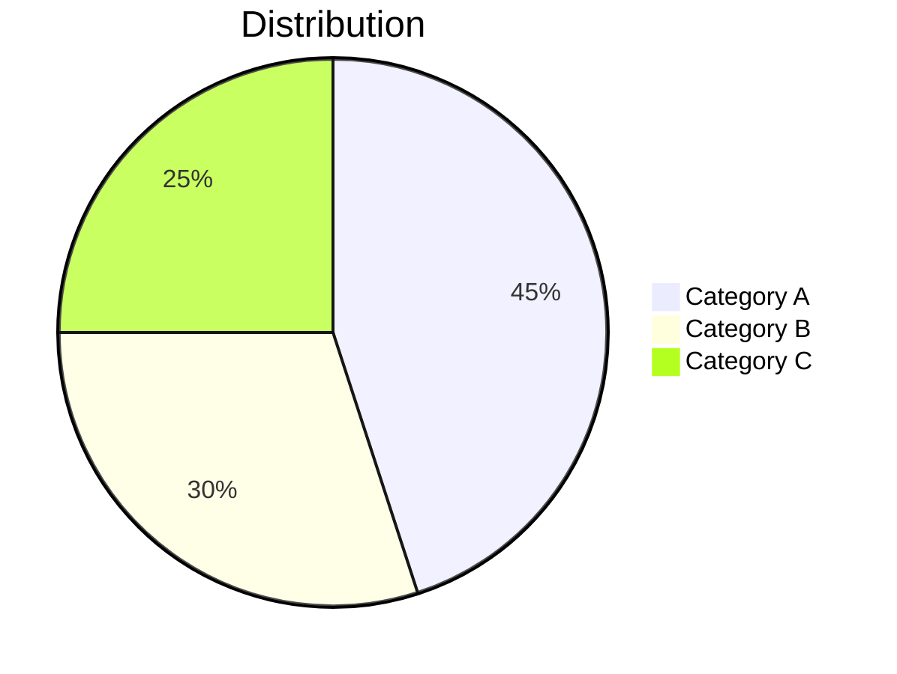

# AI Illustrated Summary Generator

Generate a structured, illustrated summary report with Mermaid diagrams from multiple source types.

## Phase 0: Input Parsing

Parse `$ARGUMENTS` to classify each input:

1. **YouTube URLs**: Contains `youtube.com/watch` or `youtu.be/`
2. **Web URLs**: Starts with `http://` or `https://` (not YouTube)
3. **PDF files**: Ends with `.pdf`
4. **Documents**: Ends with `.docx` or `.txt`
5. **Audio/Video**: Ends with `.mp3`, `.mp4`, `.wav`, `.mov`
6. **Mixed**: Any combination of the above

If `$ARGUMENTS` is empty, ask the user what content they want to summarize.

For local files, verify each file exists with `ls -la <path>`. If a file doesn't exist, tell the user and skip it.

---

## Phase 1: Content Extraction

Extract text from each input source. Accumulate all extracted text into a single `allTexts` variable.

### 1a. PDF Extraction (Smart Routing)

First, detect PDF page count:

```bash
# Attempt to detect page count (works for most PDFs)
PAGE_COUNT=$(strings "<pdf_path>" | grep -c "/Type\s*/Page[^s]" 2>/dev/null || echo "0")
```

If page count detection fails or returns 0, assume >5 pages.

**Route A — PDF ≤5 pages (Claude Read, zero config):**

```
Read the PDF file directly:
  Read("<pdf_path>")
  or Read("<pdf_path>", pages="1-5")
```

Claude's multimodal Read tool extracts text AND understands embedded charts/tables/images visually. Record any chart or table descriptions as `sourceImages` for later reference.

**Route B — PDF >5 pages (Azure DI, needs KEY):**

Check if `$AZURE_DI_ENDPOINT` and `$AZURE_DI_KEY` are set:

```bash
[ -n "$AZURE_DI_ENDPOINT" ] && [ -n "$AZURE_DI_KEY" ] && echo "DI_AVAILABLE" || echo "DI_NOT_AVAILABLE"
```

If DI is available, submit the PDF for extraction:

```bash
# Step 1: Submit analysis job
OPERATION_URL=$(curl -sS -D - -o /dev/null \
  -X POST "${AZURE_DI_ENDPOINT}/documentintelligence/documentModels/prebuilt-read:analyze?api-version=2024-11-30" \
  -H "Ocp-Apim-Subscription-Key: ${AZURE_DI_KEY}" \
  -H "Content-Type: application/pdf" \
  --data-binary @"<pdf_path>" \
  2>/dev/null | grep -i "operation-location" | tr -d '\r' | awk '{print $2}')

# Step 2: Poll for result (max 30 attempts, 2s apart)
for i in $(seq 1 30); do
  RESULT=$(curl -sS "$OPERATION_URL" \
    -H "Ocp-Apim-Subscription-Key: ${AZURE_DI_KEY}" 2>/dev/null)
  if echo "$RESULT" | grep -q '"succeeded"'; then
    # Extract text content from result
    echo "$RESULT" | python3 -c "
import sys, json
data = json.load(sys.stdin)
content = data.get('analyzeResult', {}).get('content', '')
print(content)
" 2>/dev/null || echo "$RESULT"
    break
  fi
  sleep 2
done
```

For **multiple PDFs >5 pages**, submit them in parallel:

```bash
# Submit all PDFs simultaneously
curl ... @doc1.pdf &
curl ... @doc2.pdf &
curl ... @doc3.pdf &
wait  # Total time = max(individual) instead of sum
```

If DI is NOT available and PDF >5 pages:

Tell the user:
> "This PDF has more than 5 pages. For best results, configure Azure Document Intelligence:
> 1. Set `AZURE_DI_ENDPOINT` and `AZURE_DI_KEY` environment variables
> 2. See README.md for setup instructions
>
> Proceeding with Claude Read (slower, max 20 pages per read)..."

Then fall back to paginated Claude Read:
```
Read("<pdf_path>", pages="1-20")
Read("<pdf_path>", pages="21-40")
... (continue until all pages read)
```

### 1b. DOCX / TXT Extraction

```
Read("<file_path>")
```

Direct Claude Read. Works for all sizes.

### 1c. URL Extraction

```
WebFetch("<url>")
```

Extract the main content. If WebFetch returns HTML, extract the article body text and ignore navigation/footer.

### 1d. YouTube Transcript Extraction

Check if `$SUPADATA_API_KEY` is set:

```bash
[ -n "$SUPADATA_API_KEY" ] && echo "SUPADATA_AVAILABLE" || echo "SUPADATA_NOT_AVAILABLE"
```

If available:

```bash
# Extract video ID from URL
VIDEO_ID=$(echo "<youtube_url>" | grep -oP '(?:v=|youtu\.be/)([a-zA-Z0-9_-]{11})' | head -1 | sed 's/v=//')

# Fetch transcript
TRANSCRIPT=$(curl -sS "https://api.supadata.ai/v1/youtube/transcript?videoId=${VIDEO_ID}&text=true" \
  -H "x-api-key: ${SUPADATA_API_KEY}" 2>/dev/null)

echo "$TRANSCRIPT"
```

If NOT available:
> "YouTube transcription requires a Supadata API key. Set `SUPADATA_API_KEY` environment variable. See README.md for details."

### 1e. Audio/Video Transcription

Check if `$DEEPGRAM_API_KEY` is set:

```bash
[ -n "$DEEPGRAM_API_KEY" ] && echo "DEEPGRAM_AVAILABLE" || echo "DEEPGRAM_NOT_AVAILABLE"
```

If available:

```bash
TRANSCRIPT=$(curl -sS "https://api.deepgram.com/v1/listen?model=nova-3&smart_format=true&detect_language=true" \
  -H "Authorization: Token ${DEEPGRAM_API_KEY}" \
  -H "Content-Type: audio/mpeg" \
  --data-binary @"<audio_path>" 2>/dev/null)

# Extract transcript text
echo "$TRANSCRIPT" | python3 -c "
import sys, json
data = json.load(sys.stdin)
text = data.get('results', {}).get('channels', [{}])[0].get('alternatives', [{}])[0].get('transcript', '')
print(text)
" 2>/dev/null
```

If NOT available:
> "Audio/video transcription requires a Deepgram API key. Set `DEEPGRAM_API_KEY` environment variable. See README.md for details."

### 1f. Merge All Extracted Content

After extracting from all sources, combine into `allTexts`:

```
--- Source: report.pdf ---
[extracted PDF text]

--- Source: https://example.com ---
[extracted web content]

--- Source: YouTube: xxx ---
[transcript text]
```

---

## Phase 2: AI Summary Generation

Claude generates the summary directly — no external AI API needed.

### Step A: Fact Pre-extraction

Read the merged `allTexts` and extract all factual claims with supporting quotes from the source text.

For each fact, record:
- `claim`: A factual statement
- `source_quote`: The exact or near-exact quote from the source

Validation rules:
- Only extract facts explicitly stated in the text
- Do NOT add knowledge from your training data
- Include: specific numbers, percentages, dates, names, conclusions, causal claims
- Target: 20-40 verified facts covering all major sections

### Step B: Outline Generation

Generate a structured outline in your mind:

```
title: One-line core insight headline
abstract: 2-3 sentence summary answering "so what" with key quantitative conclusions
sections: 3-6 topic chapters, each with:
  - heading: Chapter title (numbered)
  - sub_sections: Each with heading + 2-3 key_points
conclusion: 3 actionable recommendations
```

**Anti-hallucination rules (HIGHEST PRIORITY):**
- Every key_point MUST have a source text basis. Can't find it in source → don't write it
- Numbers and percentages must appear verbatim in source text. No filling from training knowledge
- Fewer truthful chapters >> more chapters with mixed external knowledge
- You may know this topic well, but COMPLETELY IGNORE your training knowledge. Only use source text

### Step C: Fact Validation

For each key_point in the outline:
- Extract keywords (length ≥ 3, non-numeric)
- Check: Do ≥ 40% of keywords appear in the extracted facts?
- Check: Do ≥ 50% of keywords appear in the source text?
- If NEITHER check passes → remove that key_point
- Log removed key_points for transparency

### Step D: Chapter Writing + Mermaid Charts

For each section in the outline, write a Markdown chapter:

**Writing rules:**
- Use `## Chapter Title` for main heading, `###` for sub-sections
- Each sub-section: 150-250 words, use bullet lists, bold key data, tables for comparisons
- Quote exact data from source ("$1.2B", "grew 47%") — never invent numbers
- If source info is insufficient for 250 words, write 100 words. **Shorter is better than fake**
- No filler phrases ("It's worth noting", "In summary")

**Anti-hallucination rules per chapter (HIGHEST PRIORITY):**
- Before writing each sentence, find the supporting content in source text. Can't find it → don't write it
- If source is non-English transcript (e.g., Arabic), only summarize what was actually said
- Do NOT add technical terms, concepts, or metrics not mentioned in source text
- If source only discusses 2 aspects of a topic, only write about those 2 aspects

**Mermaid chart for each chapter:**

Generate 1 Mermaid diagram per chapter. Choose the best type:
- `pie` — for proportions/distributions
- `graph TD` or `graph LR` — for flows/relationships
- `flowchart LR` — for processes/decisions

Mermaid syntax rules:
- Node IDs in English, Chinese labels in double quotes: `A["Chinese content"]`
- No parentheses/brackets in node text
- Max 10 nodes per diagram
- Pie chart labels must use double quotes: `"Label" : value`

Insert each Mermaid diagram after the first paragraph of each chapter:

````markdown
## 1. Chapter Title

### 1.1 Sub-section

First paragraph of content...



Remaining content...
````

---

## Phase 3: Assembly and Output

### 3a. Assemble Final Markdown

Combine all parts:

```markdown
# {title}

**Source documents:**
- {source 1}
- {source 2}

**Summary**

{abstract}

{chapter 1 with Mermaid}

{chapter 2 with Mermaid}

...

## Conclusions and Recommendations

{conclusion}
```

### 3b. Save Output

```bash
mkdir -p ./output
```

Write the complete Markdown to `./output/summary-{YYYYMMDD-HHMMSS}.md` using the Write tool.

### 3c. Quality Self-Assessment

After generating the summary, evaluate your own output against these 4 dimensions:

- **D1 Content Fidelity (30%)**: Are all claims backed by source text? Any hallucinated data?
- **D2 Layout Compliance (25%)**: Does every chapter have a Mermaid chart? Proper heading hierarchy?
- **D3 Chart Relevance (25%)**: Are Mermaid diagrams semantically related to chapter content?
- **D4 Structure Quality (20%)**: Logical flow? Actionable conclusions? Proper source attribution?

Score each D1-D4 from 1-5, compute weighted total (max 100).

### 3d. Present Results to User

```
Summary generated successfully!

Sources: {N} documents processed
Chapters: {N} chapters with Mermaid diagrams
Quality: {score}/100 (D1:{x} D2:{x} D3:{x} D4:{x})

Saved to: ./output/summary-{timestamp}.md

--- Preview (first 2000 characters) ---
{preview}
```

---

## Error Handling Summary

| Scenario | Action |
|----------|--------|
| File not found | Skip file, warn user, continue with remaining inputs |
| PDF >5 pages, no DI KEY | Fall back to paginated Claude Read (slower) |
| YouTube URL, no Supadata KEY | Tell user to configure KEY, skip this source |
| Audio file, no Deepgram KEY | Tell user to configure KEY, skip this source |
| Azure DI timeout/error | Fall back to Claude Read with warning |
| WebFetch returns error | Tell user URL is inaccessible, skip |
| Zero sources successfully extracted | Stop and tell user: "No content could be extracted" |
| All sources extracted but very little text (<200 chars) | Warn user: "Very little content extracted, summary may be limited" |

---

## Security Checklist

- This skill contains ZERO hardcoded API keys or server URLs
- All external API calls use environment variables ($AZURE_DI_KEY, $SUPADATA_API_KEY, $DEEPGRAM_API_KEY)
- User's API keys never leave their local machine (direct curl to API providers)
- No data is sent to any intermediary server
- Output files are saved locally only
