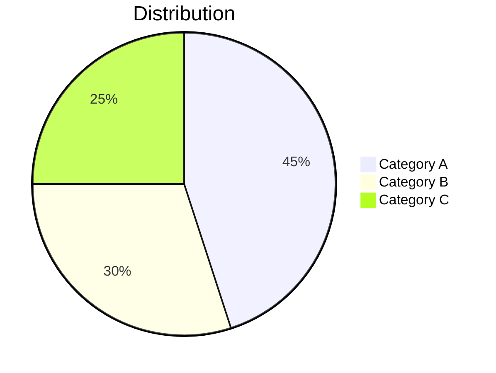

# AI Illustrated Summary Generator

**YOU MUST EXECUTE THIS SKILL IMMEDIATELY.** Do not explain, do not ask — START DOING IT NOW.

Your task: Generate an illustrated summary report for the user's input `$ARGUMENTS`.

**Execution checklist — complete ALL steps in order, do not skip any:**
- [ ] Pre-check: Run env detection bash command
- [ ] Phase 0: Classify inputs
- [ ] Phase 1: Extract content (use tools: Read/WebFetch/Bash curl)
- [ ] Phase 2: Generate summary with Mermaid diagrams (write directly, no external AI API)
- [ ] Phase 3: Save .md + .html files to ./output/, show quality score

Begin with Pre-check NOW:

## Pre-check: Environment Capability Detection

Before processing inputs, detect which API keys are available. Run:

```bash
echo "=== AI Summary Skill: Environment Check ==="
[ -n "$AZURE_DI_ENDPOINT" ] && [ -n "$AZURE_DI_KEY" ] && echo "AZURE_DI=YES" || echo "AZURE_DI=NO"
[ -n "$SUPADATA_API_KEY" ] && echo "SUPADATA=YES" || echo "SUPADATA=NO"
[ -n "$DEEPGRAM_API_KEY" ] && echo "DEEPGRAM=YES" || echo "DEEPGRAM=NO"
```

Based on the output, briefly tell the user (1 line per capability):
- ✅ for available capabilities
- ⬚ for unavailable ones (with one-line hint: which key + registration URL)

Example output: "✅ Web/Docs/Small PDF | ⬚ YouTube (needs SUPADATA_API_KEY → supadata.ai)"

**Do NOT show a full configuration guide unless all capabilities the user needs are missing.** If the user's input can be processed with current keys, proceed immediately to Phase 0.

---

## Phase 0: Input Parsing

Parse `$ARGUMENTS` to classify each input:

1. **YouTube URLs**: Contains `youtube.com/watch` or `youtu.be/`
2. **Web URLs**: Starts with `http://` or `https://` (not YouTube)
3. **PDF files**: Ends with `.pdf`
4. **Documents**: Ends with `.docx` or `.txt`
5. **Audio/Video**: Ends with `.mp3`, `.mp4`, `.wav`, `.mov`
6. **Mixed**: Any combination of the above

If `$ARGUMENTS` is empty, ask the user what content they want to summarize.

For local files, verify each file exists with `ls -la <path>`. If a file doesn't exist, tell the user and skip it.

---

## Phase 1: Content Extraction

Extract text from each input source. Accumulate all extracted text into a single `allTexts` variable.

### 1a. PDF Extraction (Smart Routing)

First, detect PDF page count:

```bash
# Detect PDF page count (cross-platform, reliable)
PAGE_COUNT=$(python3 -c "
import re, sys
with open('<pdf_path>', 'rb') as f:
    content = f.read()
# Count /Type /Page (not /Pages) objects
count = len(re.findall(rb'/Type\s*/Page[^s]', content))
print(count if count > 0 else 999)
" 2>/dev/null || echo "999")
```

If python3 is not available, try pdfinfo:

```bash
PAGE_COUNT=$(pdfinfo "<pdf_path>" 2>/dev/null | grep "^Pages:" | awk '{print $2}' || echo "999")
```

If page count detection fails or returns 0, assume >5 pages.

**Route A — PDF ≤5 pages (Claude Read, zero config):**

```
Read the PDF file directly:
  Read("<pdf_path>")
  or Read("<pdf_path>", pages="1-5")
```

Claude's multimodal Read tool extracts text AND understands embedded charts/tables/images visually. Record any chart or table descriptions as `sourceImages` for later reference.

**Route B — PDF >5 pages (Azure DI, needs KEY):**

Check if `$AZURE_DI_ENDPOINT` and `$AZURE_DI_KEY` are set:

```bash
[ -n "$AZURE_DI_ENDPOINT" ] && [ -n "$AZURE_DI_KEY" ] && echo "DI_AVAILABLE" || echo "DI_NOT_AVAILABLE"
```

If DI is available, submit the PDF for extraction:

```bash
# Step 1: Submit analysis job
OPERATION_URL=$(curl -sS -D - -o /dev/null \
  -X POST "${AZURE_DI_ENDPOINT}/documentintelligence/documentModels/prebuilt-read:analyze?api-version=2024-11-30" \
  -H "Ocp-Apim-Subscription-Key: ${AZURE_DI_KEY}" \
  -H "Content-Type: application/pdf" \
  --data-binary @"<pdf_path>" \
  2>/dev/null | grep -i "operation-location" | tr -d '\r' | awk '{print $2}')

# Step 2: Poll for result (max 30 attempts, 2s apart)
for i in $(seq 1 30); do
  RESULT=$(curl -sS "$OPERATION_URL" \
    -H "Ocp-Apim-Subscription-Key: ${AZURE_DI_KEY}" 2>/dev/null)
  if echo "$RESULT" | grep -q '"succeeded"'; then
    # Extract text content from result
    echo "$RESULT" | python3 -c "
import sys, json
data = json.load(sys.stdin)
content = data.get('analyzeResult', {}).get('content', '')
print(content)
" 2>/dev/null || echo "$RESULT"
    break
  fi
  sleep 2
done
```

For **multiple PDFs >5 pages**, submit them in parallel:

```bash
# Submit all PDFs simultaneously
curl ... @doc1.pdf &
curl ... @doc2.pdf &
curl ... @doc3.pdf &
wait  # Total time = max(individual) instead of sum
```

If DI is NOT available and PDF >5 pages:

Tell the user:
> ⚠️ **Large PDF detected (>5 pages), but Azure Document Intelligence is not configured.**
>
> For faster and more accurate extraction, set it up in 3 steps:
>
> 1. Go to [Azure Portal](https://portal.azure.com/) → search "Document Intelligence" → create resource (**F0 free tier: 500 pages/month**)
> 2. After creation, find **Keys and Endpoint** on the resource page, copy the Key and Endpoint
> 3. Set environment variables and restart Claude Code:
>    ```bash
>    export AZURE_DI_ENDPOINT="https://your-instance.cognitiveservices.azure.com"
>    export AZURE_DI_KEY="your_key_here"
>    ```
>
> Proceeding with Claude paginated read (slower, but still works)...

Then fall back to paginated Claude Read:
```
Read("<pdf_path>", pages="1-20")
Read("<pdf_path>", pages="21-40")
... (continue until all pages read)
```

### 1b. DOCX / TXT Extraction

```
Read("<file_path>")
```

Direct Claude Read. Works for all sizes.

### 1c. URL Extraction

Try WebFetch first. If it fails (SSL error, timeout, etc.), fall back to curl:

```
Primary:   WebFetch("<url>", prompt="Extract all text content from this page")
Fallback:  Bash: curl -sS -L "<url>" 2>/dev/null | head -5000
```

If using curl fallback, strip HTML tags mentally and extract the article body text. Ignore navigation/footer/scripts.

### 1d. YouTube Transcript Extraction

Check if `$SUPADATA_API_KEY` is set:

```bash
[ -n "$SUPADATA_API_KEY" ] && echo "SUPADATA_AVAILABLE" || echo "SUPADATA_NOT_AVAILABLE"
```

If available:

```bash
# Extract video ID from URL
VIDEO_ID=$(echo "<youtube_url>" | grep -oP '(?:v=|youtu\.be/)([a-zA-Z0-9_-]{11})' | head -1 | sed 's/v=//')

# Fetch transcript
TRANSCRIPT=$(curl -sS "https://api.supadata.ai/v1/youtube/transcript?videoId=${VIDEO_ID}&text=true" \
  -H "x-api-key: ${SUPADATA_API_KEY}" 2>/dev/null)

echo "$TRANSCRIPT"
```

If NOT available, tell the user:
> ❌ **YouTube summarization requires a Supadata API Key.** Set it up in 3 steps:
>
> 1. Sign up at [supadata.ai](https://supadata.ai/) (**free tier: 50 requests/month**)
> 2. Get your API Key from the Dashboard
> 3. Set the environment variable and restart Claude Code:
>    ```bash
>    export SUPADATA_API_KEY="your_key_here"
>    ```
>
> Then re-run `/summarize` to try again.

Then **stop processing this YouTube input** (skip it, do not error out). If there are other non-YouTube inputs, continue processing them.

### 1e. Audio/Video Transcription

Check if `$DEEPGRAM_API_KEY` is set:

```bash
[ -n "$DEEPGRAM_API_KEY" ] && echo "DEEPGRAM_AVAILABLE" || echo "DEEPGRAM_NOT_AVAILABLE"
```

If available:

```bash
TRANSCRIPT=$(curl -sS "https://api.deepgram.com/v1/listen?model=nova-3&smart_format=true&detect_language=true" \
  -H "Authorization: Token ${DEEPGRAM_API_KEY}" \
  -H "Content-Type: audio/mpeg" \
  --data-binary @"<audio_path>" 2>/dev/null)

# Extract transcript text
echo "$TRANSCRIPT" | python3 -c "
import sys, json
data = json.load(sys.stdin)
text = data.get('results', {}).get('channels', [{}])[0].get('alternatives', [{}])[0].get('transcript', '')
print(text)
" 2>/dev/null
```

If NOT available, tell the user:
> ❌ **Audio/video transcription requires a Deepgram API Key.** Set it up in 3 steps:
>
> 1. Sign up at [deepgram.com](https://deepgram.com/) (**free $200 credit**)
> 2. Go to Dashboard → API Keys → create a new Key
> 3. Set the environment variable and restart Claude Code:
>    ```bash
>    export DEEPGRAM_API_KEY="your_key_here"
>    ```
>
> Then re-run `/summarize` to try again.

Then **stop processing this audio/video input** (skip it, do not error out). If there are other inputs, continue processing them.

### 1f. Merge All Extracted Content

After extracting from all sources, combine into `allTexts`:

```
--- Source: report.pdf ---
[extracted PDF text]

--- Source: https://example.com ---
[extracted web content]

--- Source: YouTube: xxx ---
[transcript text]
```

---

## Phase 2: AI Summary Generation

You (Claude) generate the summary directly — no external AI API needed. **Do ALL 4 steps below. Do NOT skip any step.**

### Step A: Fact Pre-extraction (MANDATORY — do this BEFORE writing anything)

Scan the extracted content and list 10-40 key facts. Output them as a numbered list in your thinking:

```
FACTS:
1. [claim] — "[exact quote from source]"
2. [claim] — "[exact quote from source]"
...
```

Rules: Only facts explicitly in the source. NO training knowledge. Include numbers, dates, names, percentages.

### Step B: Outline Generation (MANDATORY — plan before writing)

Design the report structure. Output this outline explicitly:

```
OUTLINE:
Title: [one-line core insight]
Abstract: [2-3 sentences with key quantitative conclusions]
Sections:
  1. [chapter heading] → [2-3 sub-sections]
  2. [chapter heading] → [2-3 sub-sections]
  3. [chapter heading] → [2-3 sub-sections]
Conclusion: [3 actionable recommendations]
```

Target 3-6 chapters. **Every key_point must trace back to a fact from Step A. Can't find source basis → delete it.**

### Step C: Validate (quick self-check)

For each outline key_point: can you point to a specific fact from Step A? If not, remove it. Fewer truthful chapters >> more chapters with hallucinated content.

**ANTI-HALLUCINATION RULE (HIGHEST PRIORITY):** COMPLETELY IGNORE your training knowledge about this topic. Only use the extracted source text.

### Step D: Chapter Writing + Mermaid Charts

For each section in the outline, write a Markdown chapter:

**Writing rules:**
- Use `## Chapter Title` for main heading, `###` for sub-sections
- Each sub-section: 150-250 words, use bullet lists, bold key data, tables for comparisons
- Quote exact data from source ("$1.2B", "grew 47%") — never invent numbers
- If source info is insufficient for 250 words, write 100 words. **Shorter is better than fake**
- No filler phrases ("It's worth noting", "In summary")

**Anti-hallucination rules per chapter (HIGHEST PRIORITY):**
- Before writing each sentence, find the supporting content in source text. Can't find it → don't write it
- If source is non-English transcript (e.g., Arabic), only summarize what was actually said
- Do NOT add technical terms, concepts, or metrics not mentioned in source text
- If source only discusses 2 aspects of a topic, only write about those 2 aspects

**Mermaid chart for each chapter:**

Generate 1 Mermaid diagram per chapter. Choose the best type:
- `pie` — for proportions/distributions
- `graph TD` or `graph LR` — for flows/relationships
- `flowchart LR` — for processes/decisions

Mermaid syntax rules:
- Node IDs in English, non-ASCII labels in double quotes: `A["Label content"]`
- No parentheses/brackets in node text
- Max 10 nodes per diagram
- Pie chart labels must use double quotes: `"Label" : value`

Insert each Mermaid diagram after the first paragraph of each chapter:

````markdown
## 1. Chapter Title

### 1.1 Sub-section

First paragraph of content...



Remaining content...
````

---

## Phase 3: Assembly and Output

### 3a. Assemble Final Markdown

Combine all parts:

```markdown
# {title}

**Source documents:**
- {source 1}
- {source 2}

**Summary**

{abstract}

{chapter 1 with Mermaid}

{chapter 2 with Mermaid}

...

## Conclusions and Recommendations

{conclusion}
```

### 3b. Save Markdown

```bash
mkdir -p ./output
```

Write the complete Markdown to `./output/summary-{YYYYMMDD-HHMMSS}.md` using the Write tool.

### 3c. Generate HTML (Visual Preview)

Generate a standalone HTML file that renders the Markdown + Mermaid diagrams in the browser. Users can double-click to open and see the fully rendered illustrated report.

Write `./output/summary-{YYYYMMDD-HHMMSS}.html` with this template:

```html
<!DOCTYPE html>
<html lang="en">
<head>
  <meta charset="UTF-8">
  <meta name="viewport" content="width=device-width, initial-scale=1.0">
  <title>{title}</title>
  <script src="https://cdn.jsdelivr.net/npm/marked@15.0.7/marked.min.js"></script>
  <script src="https://cdn.jsdelivr.net/npm/mermaid@11.4.1/dist/mermaid.min.js"></script>
  <style>
    :root { --teal: #0F766E; --amber: #F59E0B; --slate-50: #f8fafc; --slate-700: #334155; --slate-900: #0f172a; }
    * { margin: 0; padding: 0; box-sizing: border-box; }
    body { font-family: -apple-system, 'Segoe UI', 'Noto Sans SC', sans-serif; background: var(--slate-50); color: var(--slate-700); line-height: 1.7; }
    .container { max-width: 900px; margin: 0 auto; padding: 40px 24px; }
    h1 { color: var(--teal); font-size: 2em; margin-bottom: 8px; border-bottom: 3px solid var(--amber); padding-bottom: 12px; }
    h2 { color: var(--teal); font-size: 1.5em; margin-top: 40px; margin-bottom: 16px; padding-bottom: 8px; border-bottom: 1px solid #e2e8f0; }
    h3 { color: var(--slate-900); font-size: 1.15em; margin-top: 24px; margin-bottom: 8px; }
    p { margin-bottom: 12px; }
    strong { color: var(--slate-900); }
    ul, ol { margin: 8px 0 12px 24px; }
    li { margin-bottom: 4px; }
    table { border-collapse: collapse; width: 100%; margin: 16px 0; }
    th { background: var(--teal); color: white; padding: 10px 14px; text-align: left; }
    td { padding: 8px 14px; border-bottom: 1px solid #e2e8f0; }
    tr:hover { background: #f1f5f9; }
    pre { background: #1e293b; color: #e2e8f0; padding: 16px; border-radius: 8px; overflow-x: auto; margin: 12px 0; }
    code { background: #f1f5f9; padding: 2px 6px; border-radius: 4px; font-size: 0.9em; }
    pre code { background: none; padding: 0; }
    .mermaid { background: white; padding: 20px; border-radius: 12px; margin: 20px 0; text-align: center; box-shadow: 0 1px 3px rgba(0,0,0,0.1); }
    blockquote { border-left: 4px solid var(--amber); padding: 8px 16px; margin: 12px 0; background: #fffbeb; }
    .meta { color: #94a3b8; font-size: 0.85em; margin-bottom: 24px; }
  </style>
</head>
<body>
  <div class="container">
    <div class="meta">Generated by AI Summary Skill · {date}</div>
    <div id="content"></div>
  </div>
  <script id="md-source" type="text/plain">
{MARKDOWN_CONTENT_HERE}
  </script>
  <script>
    // 1. Parse Markdown to HTML
    const md = document.getElementById('md-source').textContent;
    document.getElementById('content').innerHTML = marked.parse(md);

    // 2. Convert mermaid code blocks to mermaid divs
    //    marked.js renders ```mermaid as <pre><code class="language-mermaid">
    //    but mermaid.js needs <div class="mermaid">
    document.querySelectorAll('pre code.language-mermaid').forEach(function(codeBlock) {
      const mermaidDiv = document.createElement('div');
      mermaidDiv.className = 'mermaid';
      mermaidDiv.textContent = codeBlock.textContent;
      codeBlock.parentElement.replaceWith(mermaidDiv);
    });

    // 3. Render Mermaid diagrams
    mermaid.initialize({ startOnLoad: false, theme: 'default' });
    mermaid.run();
  </script>
</body>
</html>
```

Replace `{MARKDOWN_CONTENT_HERE}` with the full Markdown content (escape any `</script>` tags in the content by replacing them with `<\/script>`).

Replace `{title}` with the summary title, `{date}` with the current date.

### 3e. Quality Self-Assessment

After generating the summary, evaluate your own output against these 4 dimensions:

- **D1 Content Fidelity (30%)**: Are all claims backed by source text? Any hallucinated data?
- **D2 Layout Compliance (25%)**: Does every chapter have a Mermaid chart? Proper heading hierarchy?
- **D3 Chart Relevance (25%)**: Are Mermaid diagrams semantically related to chapter content?
- **D4 Structure Quality (20%)**: Logical flow? Actionable conclusions? Proper source attribution?

Score each D1-D4 from 1-5, compute weighted total (max 100).

### 3f. Present Results to User

```
Summary generated successfully!

Sources: {N} documents processed
Chapters: {N} chapters with Mermaid diagrams
Quality: {score}/100 (D1:{x} D2:{x} D3:{x} D4:{x})

Saved to:
  Markdown: ./output/summary-{timestamp}.md
  HTML:     ./output/summary-{timestamp}.html  (double-click to open in browser)

--- Preview (first 2000 characters) ---
{preview}
```

---

## Error Handling Summary

| Scenario | Action |
|----------|--------|
| File not found | Skip file, warn user, continue with remaining inputs |
| PDF >5 pages, no DI KEY | Fall back to paginated Claude Read (slower) |
| YouTube URL, no Supadata KEY | Tell user to configure KEY, skip this source |
| Audio file, no Deepgram KEY | Tell user to configure KEY, skip this source |
| Azure DI timeout/error | Fall back to Claude Read with warning |
| WebFetch returns error | Tell user URL is inaccessible, skip |
| Zero sources successfully extracted | Stop and tell user: "No content could be extracted" |
| All sources extracted but very little text (<200 chars) | Warn user: "Very little content extracted, summary may be limited" |

---

## Security Checklist

- This skill contains ZERO hardcoded API keys or server URLs
- All external API calls use environment variables ($AZURE_DI_KEY, $SUPADATA_API_KEY, $DEEPGRAM_API_KEY)
- User's API keys never leave their local machine (direct curl to API providers)
- No data is sent to any intermediary server
- Output files are saved locally only
